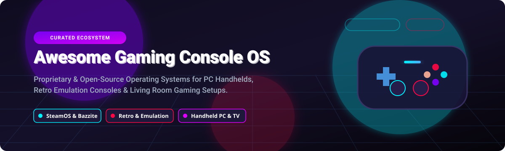

# Awesome Gaming Console Operating System 🎮🕹️

  

  
  
  
  

**A curated directory of proprietary console operating systems and open-source Linux distributions for PC handhelds, retro emulation machines, and living room gaming PCs.** 🚀

*Focused on Steam Deck, ROG Ally, Legion Go, Raspberry Pi, RetroArch, and Custom Living Room OS setups.* 🕹️💻

**Last updated: October 2026** 📅

---

## 💡 Overview & Ecosystem Insights

This repository tracks notable **proprietary console operating systems** and **open-source gaming distributions**. These platforms transform PCs, handhelds, and single-board computers into seamless, controller-friendly gaming machines—booting directly into full-screen launcher interfaces with minimal setup.

Whether you're setting up a Steam Deck alternative, an immutable Linux couch PC, or a dedicated retro emulation box (Raspberry Pi / x86), this guide provides clear insights into platform features, pricing models, hardware compatibility, and project popularity.

---

## 📖 Table of Contents

- [🏢 Proprietary Console OS & Commercial Platforms](#-proprietary-console-os--commercial-platforms)
- [🔓 Open-Source Gaming OS Projects](#-open-source-gaming-os-projects)
- [🤝 How to Contribute](#-how-to-contribute)
- [⭐ Star History](#-star-history)
- [💖 Support & Sponsorship](#-support--sponsorship)
- [⚠️ Disclaimer](#%EF%B8%8F-disclaimer)

---

## 🏢 Proprietary Console OS & Commercial Platforms

> **📊 Market Context & Structure**: The global gaming console and handheld market is estimated at **~$45B in 2026**, powering **hundreds of millions of active devices** worldwide. The proprietary console sector is **highly concentrated** (a tight oligopoly dominated by Sony, Microsoft, and Nintendo), while **Valve's SteamOS** acts as a powerful bridge connecting open-source Linux with AAA PC gaming. Open-source distributions offer unmatched customization, retro emulator support, and non-proprietary hardware freedom.

| Company Size / Market Cap | Platform | Description | Pricing (Starting Tier) | Free Tier / Trial Limits |
|:--------------------------|:---------|:------------|:------------------------|:-------------------------|
| **~$400B revenue (Apple)** 🍏 | **[tvOS](https://www.apple.com/apple-tv-4k/)** | **Apple's TV operating system.** Powers Apple TV 4K with controller-based gaming via Apple Arcade & cloud apps. | **$129** (Apple TV 4K hardware) + **$6.99/mo** (Apple Arcade) | **30-day free trial** of Apple Arcade with purchase of Apple hardware. |
| **~$350B revenue (Alphabet)** 🔍 | **[Android TV / Google TV](https://www.google.com/tv/)** | **Google's TV platform.** Supports cloud gaming (GeForce NOW, Xbox Cloud) and native Android games. | **$29.99** (Google TV HD streamer) | **Free forever** base platform; cloud streaming services offer free 1-hour sessions (GeForce NOW). |
| **~$281B revenue (Microsoft)** 🟩 | **[Xbox OS](https://www.xbox.com/)** | **Microsoft's custom Windows-based OS.** Powers Xbox Series X/S and Xbox One with full Game Pass & Cloud integration. | **$299.99** (Xbox Series S hardware) | **No standalone OS purchase**; Xbox Game Pass Ultimate offers **14-day trial for $1**. |
| **~$250B revenue (Samsung)** 📱 | **[Tizen](https://www.tizen.org/)** | **Samsung's Linux smart TV OS.** Includes Samsung Gaming Hub with direct streaming apps. | **Bundled with Samsung Smart TVs** (starting ~$199) | **Free forever** with TV; individual cloud gaming apps require standard accounts/subscriptions. |
| **~$60B revenue (LG)** 📺 | **[webOS](https://www.lg.com/)** | **LG's smart TV operating system.** Integrated streaming hub with GeForce NOW and Amazon Luna support. | **Bundled with LG Smart TVs** (starting ~$179) | **Free forever** with TV hardware purchase. |
| **~$30B gaming revenue (Sony)** 🟦 | **[PlayStation OS](https://www.playstation.com/)** | **Sony's FreeBSD-based custom OS (Orbis/Prospero).** Powers PS4 & PS5 with curated storefronts. | **$399.99** (PS5 Digital Edition) | **No standalone OS purchase**; PlayStation Plus offers **7-day free trial** for select tiers. |
| **~$12B revenue (Nintendo)** 🔴 | **[Nintendo Switch OS](https://www.nintendo.com/)** | **Nintendo's microkernel Horizon OS.** Dedicated mobile/docked handheld hybrid gaming OS. | **$199.99** (Nintendo Switch Lite) | **No standalone OS purchase**; Nintendo Switch Online offers **7-day free trial**. |
| **~$6.5B revenue (Valve)** 🚂 | **[SteamOS](https://store.steampowered.com/steamos)** | **Valve's Arch Linux-based handheld OS.** Preloaded on Steam Deck, direct boot Gamepad UI. | **Free** (software download) / **$399** (Steam Deck 256GB) | **Free forever** software download for compatible handhelds and PCs. |

---

## 🔓 Open-Source Gaming OS Projects

*Top community-maintained gaming distributions sorted by GitHub star popularity.* ⭐

| Stars_Badge | Repo & Overview | Key Features & Target Devices | Primary Tech |
|:------------|:----------------|:------------------------------|:-------------|
|  | **[RetroPie](https://github.com/RetroPie/RetroPie-Setup)** 🕹️ | **Deepest customization option for retro gaming.** Modular setup script built on top of Raspbian/Debian. Over 50 emulated systems and massive community support. | Shell / C++ |
|  | **[Bazzite](https://github.com/ublue-os/bazzite)** 🚀 | **Leading community SteamOS alternative.** Immutable Fedora Atomic base with container architecture. Supports 20+ handhelds (Steam Deck, ROG Ally, Legion Go) and NVIDIA GPUs. | Containerfile / Shell |
|  | **[Batocera.linux](https://github.com/batocera-linux/batocera.linux)** 👾 | **Most feature-rich plug-and-play retrogaming OS.** Supports 200+ systems out of the box. Runs directly from USB/SD card without modifying internal drive. | Buildroot / Python |
|  | **[Recalbox](https://github.com/Recalbox/recalbox)** 📦 | **Beginner-friendly retrogaming OS for arcade & Pi.** Buildroot-based GNU/Linux with plug-and-play setup. Supports Raspberry Pi 5, Steam Deck, and arcade cabinets. | C++ / Python |
|  | **[ChimeraOS](https://github.com/ChimeraOS/chimeraos)** 🛋️ | **Pure couch gaming living room OS.** Boots straight into Steam Gamepad UI. Immutable OS with automatic background updates and GOG/Epic web app installer. | Python / Shell |
|  | **[Lakka](https://github.com/libretro/Lakka-LibreELEC)** 🦎 | **Official RetroArch console distribution.** Ultra-lightweight LibreELEC base turning computers into standalone RetroArch consoles with minimal boot times. | C / Makefile |
|  | **[JELOS / KOS](https://github.com/JELOS-Linux/JELOS)** 📱 | **Just Enough Linux OS for handheld retro devices.** Community-developed Linux distribution for portable ARM and x86 retro gaming handhelds. | Shell / C |
|  | **[Kazeta](https://github.com/kazetaos/kazeta)** 📼 | **Nostalgic 1990s physical cartridge console OS.** Immutable Linux turning DRM-free game media into physical insert-and-play cartridges. | Rust / Shell |
|  | **[Nobara Project](https://github.com/Nobara-Project/nobara-release)** 🐧 | **Gaming-modified Fedora distribution.** Created by Thomas Crider (GloriousEggroll). Includes kernel patches, WINE/Proton-GE, and preloaded gaming drivers. | Shell / Python |
|  | **[Unia OS](https://github.com/BlackBoyZeus/UniaOperatingSystem)** 🤖 | **AI-native gaming console OS written in Rust.** Next-gen experimental console OS focusing on AI-enhanced game execution and safety. | Rust |
|  | **[CachyOS Handheld](https://github.com/CachyOS/cachyos-handheld)** ⚡ | **Performance-tuned Arch handheld distribution.** Features custom CPU schedulers (LAVD), Game Mode switching, and aggressive compiler optimizations. | PKGBUILD / Shell |
|  | **[FunKey-OS](https://github.com/FunKey-Project/FunKey-OS)** 🔑 | **Ultra-compact embedded Linux for mini handhelds.** Tailored Buildroot distribution powering keychain-sized micro gaming hardware. | C / Make |

---

## 🤝 How to Contribute

Contributions are welcome! Please follow these simple guidelines:

1. 🍴 Fork the repository.
2. 📝 Edit `README.md` to add new gaming console OS projects or update details.
3. 📌 Ensure entries include proper formatting, links, and concise descriptions.
4. 🚀 Submit a Pull Request with a clear description of your changes.

Check out [Awesome-Awesome-Awesome](https://github.com/ishandutta2007/Awesome-Awesome-Awesome) for more awesome lists!

---

## ⭐ Star History

---

## 💖 Support & Sponsorship

Thank you for visiting and supporting the **Awesome Gaming Console Operating System** list! 🌟

If you find this repository helpful, please consider:
- ⭐ **Starring** the repository on GitHub
- 🔀 **Forking** and contributing new projects
- 📢 **Sharing** with fellow handheld PC and retro gaming enthusiasts
- ☕ **Sponsoring** or buying a coffee via the [Sponsor Dashboard](https://github.com/sponsors/ishandutta2007)

---

## ⚠️ Disclaimer

- This is a community-curated collection for educational and informational purposes.
- All product names, logos, and brands are property of their respective owners.
- Ensure compliance with hardware warranties and software licensing when installing third-party operating systems on gaming consoles or handhelds.
